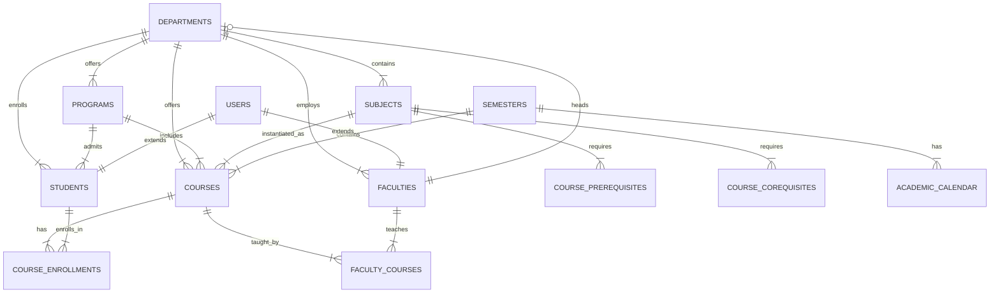

# NimbusU Course Service - Database Schema

This document defines the PostgreSQL database schema for the **Course Service**, which manages academic structure, courses, enrollments, and faculty assignments.

**Database Name:** `course_service_db`  
**Port:** 8084

---

## 1. Overview

The Course Service is responsible for:

- Department and program management
- Subject and course catalog
- Faculty-course assignments
- Student enrollments
- Academic calendar and semester management
- Faculty and student profile extensions

---

## 2. Tables

### 2.1. Departments (`departments`)

Academic departments in the university.

| Column               | Type         | Constraints                      | Description                 |
| -------------------- | ------------ | -------------------------------- | --------------------------- |
| `department_id`      | UUID         | PK, DEFAULT gen_random_uuid()    | Unique identifier           |
| `department_name`    | VARCHAR(100) | UNIQUE, NOT NULL                 | Full department name        |
| `department_code`    | VARCHAR(20)  | UNIQUE, NOT NULL                 | Short code (e.g., CSE, ECE) |
| `head_of_department` | UUID         | FK -> faculties.faculty_id, NULL | Department head             |
| `description`        | TEXT         | NULL                             | Department description      |
| `is_active`          | BOOLEAN      | DEFAULT true                     | Active status               |
| `created_at`         | TIMESTAMPTZ  | DEFAULT now()                    | Creation timestamp          |
| `updated_at`         | TIMESTAMPTZ  | DEFAULT now()                    | Last update timestamp       |

**Indexes:**

- `idx_departments_code` on `department_code`
- `idx_departments_active` on `is_active`

---

### 2.2. Programs (`programs`)

Degree programs offered by departments.

| Column           | Type         | Constraints                               | Description                                  |
| ---------------- | ------------ | ----------------------------------------- | -------------------------------------------- |
| `program_id`     | UUID         | PK, DEFAULT gen_random_uuid()             | Unique identifier                            |
| `program_name`   | VARCHAR(100) | NOT NULL                                  | Program name (e.g., B.Tech Computer Science) |
| `program_code`   | VARCHAR(20)  | UNIQUE, NOT NULL                          | Short code (BTCS, MTech)                     |
| `department_id`  | UUID         | FK -> departments.department_id, NOT NULL | Parent department                            |
| `degree_type`    | VARCHAR(50)  | NULL                                      | Bachelor, Master, PhD                        |
| `duration_years` | INTEGER      | NOT NULL                                  | Program duration in years                    |
| `total_credits`  | INTEGER      | NULL                                      | Total credits required for graduation        |
| `description`    | TEXT         | NULL                                      | Program description                          |
| `is_active`      | BOOLEAN      | DEFAULT true                              | Active status                                |
| `created_at`     | TIMESTAMPTZ  | DEFAULT now()                             | Creation timestamp                           |
| `updated_at`     | TIMESTAMPTZ  | DEFAULT now()                             | Last update timestamp                        |

**Indexes:**

- `idx_programs_department` on `department_id`
- `idx_programs_code` on `program_code`
- `idx_programs_active` on `is_active`

---

### 2.3. Subjects (`subjects`)

Academic subjects/modules that can be offered as courses.

| Column          | Type         | Constraints                                               | Description                 |
| --------------- | ------------ | --------------------------------------------------------- | --------------------------- |
| `subject_id`    | UUID         | PK, DEFAULT gen_random_uuid()                             | Unique identifier           |
| `subject_name`  | VARCHAR(255) | NOT NULL                                                  | Full subject name           |
| `subject_code`  | VARCHAR(20)  | UNIQUE, NOT NULL                                          | Subject code (CS101, MA201) |
| `department_id` | UUID         | FK -> departments.department_id, NOT NULL                 | Offering department         |
| `credits`       | INTEGER      | NOT NULL                                                  | Credit hours                |
| `subject_type`  | VARCHAR(50)  | CHECK(subject_type IN ('theory', 'practical', 'project')) | Type of subject             |
| `description`   | TEXT         | NULL                                                      | Subject description         |
| `syllabus`      | TEXT         | NULL                                                      | Detailed syllabus content   |
| `is_active`     | BOOLEAN      | DEFAULT true                                              | Active status               |
| `created_at`    | TIMESTAMPTZ  | DEFAULT now()                                             | Creation timestamp          |
| `updated_at`    | TIMESTAMPTZ  | DEFAULT now()                                             | Last update timestamp       |

**Indexes:**

- `idx_subjects_code` on `subject_code`
- `idx_subjects_department` on `department_id`
- `idx_subjects_active` on `is_active`

---

### 2.4. Courses (`courses`)

Course instances for a specific semester.

| Column               | Type         | Constraints                                                                     | Description                 |
| -------------------- | ------------ | ------------------------------------------------------------------------------- | --------------------------- |
| `course_id`          | UUID         | PK, DEFAULT gen_random_uuid()                                                   | Unique identifier           |
| `course_code`        | VARCHAR(20)  | UNIQUE, NOT NULL                                                                | Unique course code          |
| `course_name`        | VARCHAR(255) | NOT NULL                                                                        | Course name                 |
| `subject_id`         | UUID         | FK -> subjects.subject_id, NOT NULL                                             | Base subject reference      |
| `department_id`      | UUID         | FK -> departments.department_id, NOT NULL                                       | Department offering         |
| `program_id`         | UUID         | FK -> programs.program_id, NULL                                                 | Target program              |
| `semester_id`        | UUID         | FK -> semesters.semester_id, NOT NULL                                           | Academic semester           |
| `semester_number`    | INTEGER      | NOT NULL, CHECK(semester_number BETWEEN 1 AND 8)                                | Target semester (1-8)       |
| `academic_year`      | INTEGER      | NOT NULL                                                                        | Academic year (e.g., 2024)  |
| `max_students`       | INTEGER      | NULL                                                                            | Maximum enrollment capacity |
| `current_enrollment` | INTEGER      | DEFAULT 0                                                                       | Current enrolled count      |
| `status`             | VARCHAR(20)  | DEFAULT 'draft', CHECK(status IN ('draft', 'active', 'completed', 'cancelled')) | Course status               |
| `description`        | TEXT         | NULL                                                                            | Course description          |
| `is_active`          | BOOLEAN      | DEFAULT true                                                                    | Active status               |
| `created_by`         | UUID         | NOT NULL                                                                        | User who created the course |
| `created_at`         | TIMESTAMPTZ  | DEFAULT now()                                                                   | Creation timestamp          |
| `updated_at`         | TIMESTAMPTZ  | DEFAULT now()                                                                   | Last update timestamp       |

**Indexes:**

- `idx_courses_code` on `course_code`
- `idx_courses_subject` on `subject_id`
- `idx_courses_department` on `department_id`
- `idx_courses_program` on `program_id`
- `idx_courses_semester` on `semester_id`
- `idx_courses_status` on `status`
- `idx_courses_academic_year` on `academic_year`

---

### 2.5. Course Prerequisites (`course_prerequisites`)

Prerequisite subjects for courses.

| Column                    | Type        | Constraints                         | Description                    |
| ------------------------- | ----------- | ----------------------------------- | ------------------------------ |
| `prerequisite_id`         | UUID        | PK, DEFAULT gen_random_uuid()       | Unique identifier              |
| `subject_id`              | UUID        | FK -> subjects.subject_id, NOT NULL | Subject requiring prerequisite |
| `prerequisite_subject_id` | UUID        | FK -> subjects.subject_id, NOT NULL | Required prerequisite subject  |
| `is_mandatory`            | BOOLEAN     | DEFAULT true                        | Mandatory or recommended       |
| `created_at`              | TIMESTAMPTZ | DEFAULT now()                       | Creation timestamp             |

**Unique Index:** `(subject_id, prerequisite_subject_id)`

---

### 2.6. Course Corequisites (`course_corequisites`)

Corequisite subjects that must be taken together.

| Column                   | Type        | Constraints                         | Description          |
| ------------------------ | ----------- | ----------------------------------- | -------------------- |
| `corequisite_id`         | UUID        | PK, DEFAULT gen_random_uuid()       | Unique identifier    |
| `subject_id`             | UUID        | FK -> subjects.subject_id, NOT NULL | Subject              |
| `corequisite_subject_id` | UUID        | FK -> subjects.subject_id, NOT NULL | Required corequisite |
| `created_at`             | TIMESTAMPTZ | DEFAULT now()                       | Creation timestamp   |

**Unique Index:** `(subject_id, corequisite_subject_id)`

---

### 2.7. Semesters (`semesters`)

Academic semester definitions.

| Column               | Type        | Constraints                   | Description                           |
| -------------------- | ----------- | ----------------------------- | ------------------------------------- |
| `semester_id`        | UUID        | PK, DEFAULT gen_random_uuid() | Unique identifier                     |
| `semester_name`      | VARCHAR(50) | NOT NULL                      | Display name (Fall 2024, Spring 2025) |
| `semester_code`      | VARCHAR(20) | UNIQUE, NOT NULL              | Short code (F2024, S2025)             |
| `academic_year`      | INTEGER     | NOT NULL                      | Academic year                         |
| `start_date`         | DATE        | NOT NULL                      | Semester start date                   |
| `end_date`           | DATE        | NOT NULL                      | Semester end date                     |
| `registration_start` | DATE        | NULL                          | Course registration opens             |
| `registration_end`   | DATE        | NULL                          | Course registration closes            |
| `is_current`         | BOOLEAN     | DEFAULT false                 | Current active semester               |
| `created_at`         | TIMESTAMPTZ | DEFAULT now()                 | Creation timestamp                    |
| `updated_at`         | TIMESTAMPTZ | DEFAULT now()                 | Last update timestamp                 |

**Indexes:**

- `idx_semesters_current` on `is_current`
- `idx_semesters_academic_year` on `academic_year`
- `idx_semesters_dates` on `(start_date, end_date)`

---

### 2.8. Faculties (`faculties`)

Faculty member profiles (extends User Service users).

| Column           | Type         | Constraints                               | Description                                |
| ---------------- | ------------ | ----------------------------------------- | ------------------------------------------ |
| `faculty_id`     | UUID         | PK, DEFAULT gen_random_uuid()             | Unique identifier                          |
| `user_id`        | UUID         | UNIQUE, NOT NULL                          | Reference to User Service user             |
| `employee_id`    | VARCHAR(50)  | UNIQUE, NOT NULL                          | Employee ID number                         |
| `department_id`  | UUID         | FK -> departments.department_id, NOT NULL | Department assignment                      |
| `designation`    | VARCHAR(100) | NULL                                      | Job title (Professor, Assistant Professor) |
| `qualification`  | VARCHAR(255) | NULL                                      | Academic qualifications                    |
| `specialization` | TEXT         | NULL                                      | Research/teaching specialization           |
| `joining_date`   | DATE         | NULL                                      | Date of joining                            |
| `office_room`    | VARCHAR(50)  | NULL                                      | Office room number                         |
| `office_hours`   | TEXT         | NULL                                      | Available office hours (JSON)              |
| `is_active`      | BOOLEAN      | DEFAULT true                              | Active status                              |
| `created_at`     | TIMESTAMPTZ  | DEFAULT now()                             | Creation timestamp                         |
| `updated_at`     | TIMESTAMPTZ  | DEFAULT now()                             | Last update timestamp                      |

**Indexes:**

- `idx_faculties_user` on `user_id`
- `idx_faculties_employee` on `employee_id`
- `idx_faculties_department` on `department_id`
- `idx_faculties_active` on `is_active`

---

### 2.9. Students (`students`)

Student profiles (extends User Service users).

| Column                 | Type         | Constraints                                       | Description                    |
| ---------------------- | ------------ | ------------------------------------------------- | ------------------------------ |
| `student_id`           | UUID         | PK, DEFAULT gen_random_uuid()                     | Unique identifier              |
| `user_id`              | UUID         | UNIQUE, NOT NULL                                  | Reference to User Service user |
| `registration_number`  | VARCHAR(50)  | UNIQUE, NOT NULL                                  | University registration number |
| `roll_number`          | VARCHAR(50)  | NULL                                              | Class roll number              |
| `department_id`        | UUID         | FK -> departments.department_id, NOT NULL         | Department                     |
| `program_id`           | UUID         | FK -> programs.program_id, NOT NULL               | Enrolled program               |
| `current_semester`     | INTEGER      | NOT NULL, CHECK(current_semester BETWEEN 1 AND 8) | Current semester (1-8)         |
| `batch_year`           | INTEGER      | NOT NULL                                          | Admission batch year           |
| `admission_date`       | DATE         | NULL                                              | Date of admission              |
| `current_cgpa`         | NUMERIC(4,2) | NULL, CHECK(current_cgpa BETWEEN 0 AND 10)        | Current CGPA (0.00-10.00)      |
| `total_credits_earned` | INTEGER      | DEFAULT 0                                         | Total credits completed        |
| `is_active`            | BOOLEAN      | DEFAULT true                                      | Active status                  |
| `created_at`           | TIMESTAMPTZ  | DEFAULT now()                                     | Creation timestamp             |
| `updated_at`           | TIMESTAMPTZ  | DEFAULT now()                                     | Last update timestamp          |

**Indexes:**

- `idx_students_user` on `user_id`
- `idx_students_registration` on `registration_number`
- `idx_students_department` on `department_id`
- `idx_students_program` on `program_id`
- `idx_students_batch` on `batch_year`
- `idx_students_semester` on `current_semester`

---

### 2.10. Faculty Courses (`faculty_courses`)

Faculty-to-course assignments.

| Column              | Type        | Constraints                                                                                | Description                     |
| ------------------- | ----------- | ------------------------------------------------------------------------------------------ | ------------------------------- |
| `faculty_course_id` | UUID        | PK, DEFAULT gen_random_uuid()                                                              | Unique identifier               |
| `faculty_id`        | UUID        | FK -> faculties.faculty_id, NOT NULL                                                       | Faculty member                  |
| `course_id`         | UUID        | FK -> courses.course_id, NOT NULL                                                          | Course                          |
| `role`              | VARCHAR(50) | DEFAULT 'instructor', CHECK(role IN ('instructor', 'co-instructor', 'teaching_assistant')) | Assignment role                 |
| `is_primary`        | BOOLEAN     | DEFAULT false                                                                              | Primary instructor flag         |
| `assigned_by`       | UUID        | NOT NULL                                                                                   | Admin who made assignment       |
| `assigned_at`       | TIMESTAMPTZ | DEFAULT now()                                                                              | Assignment timestamp            |
| `removed_at`        | TIMESTAMPTZ | NULL                                                                                       | Removal timestamp (soft delete) |
| `is_active`         | BOOLEAN     | DEFAULT true                                                                               | Active status                   |

**Unique Index:** `(faculty_id, course_id)` WHERE `is_active = true`

**Indexes:**

- `idx_faculty_courses_faculty` on `faculty_id`
- `idx_faculty_courses_course` on `course_id`
- `idx_faculty_courses_active` on `is_active`

---

### 2.11. Course Enrollments (`course_enrollments`)

Student course enrollments.

| Column              | Type         | Constraints                                                                                                  | Description                          |
| ------------------- | ------------ | ------------------------------------------------------------------------------------------------------------ | ------------------------------------ |
| `enrollment_id`     | UUID         | PK, DEFAULT gen_random_uuid()                                                                                | Unique identifier                    |
| `student_id`        | UUID         | FK -> students.student_id, NOT NULL                                                                          | Student                              |
| `course_id`         | UUID         | FK -> courses.course_id, NOT NULL                                                                            | Course                               |
| `enrollment_status` | VARCHAR(20)  | DEFAULT 'enrolled', CHECK(enrollment_status IN ('enrolled', 'waitlisted', 'dropped', 'completed', 'failed')) | Enrollment status                    |
| `enrolled_by`       | VARCHAR(20)  | DEFAULT 'self', CHECK(enrolled_by IN ('self', 'admin', 'system'))                                            | Enrollment source                    |
| `enrollment_date`   | TIMESTAMPTZ  | DEFAULT now()                                                                                                | Enrollment timestamp                 |
| `dropped_date`      | TIMESTAMPTZ  | NULL                                                                                                         | Drop timestamp                       |
| `drop_reason`       | TEXT         | NULL                                                                                                         | Reason for dropping                  |
| `completion_date`   | TIMESTAMPTZ  | NULL                                                                                                         | Completion timestamp                 |
| `grade`             | VARCHAR(5)   | NULL                                                                                                         | Final grade (A+, A, B+, etc.)        |
| `grade_points`      | NUMERIC(3,2) | NULL                                                                                                         | Grade points (0.00-10.00)            |
| `waitlist_position` | INTEGER      | NULL                                                                                                         | Position in waitlist (if waitlisted) |
| `created_at`        | TIMESTAMPTZ  | DEFAULT now()                                                                                                | Creation timestamp                   |
| `updated_at`        | TIMESTAMPTZ  | DEFAULT now()                                                                                                | Last update timestamp                |

**Unique Index:** `(student_id, course_id)`

**Indexes:**

- `idx_enrollments_student` on `student_id`
- `idx_enrollments_course` on `course_id`
- `idx_enrollments_status` on `enrollment_status`
- `idx_enrollments_date` on `enrollment_date`

---

### 2.12. Academic Calendar (`academic_calendar`)

Academic events and deadlines.

| Column        | Type         | Constraints                           | Description                                  |
| ------------- | ------------ | ------------------------------------- | -------------------------------------------- |
| `event_id`    | UUID         | PK, DEFAULT gen_random_uuid()         | Unique identifier                            |
| `semester_id` | UUID         | FK -> semesters.semester_id, NOT NULL | Semester reference                           |
| `event_name`  | VARCHAR(255) | NOT NULL                              | Event name                                   |
| `event_type`  | VARCHAR(50)  | NOT NULL                              | Type (holiday, exam, registration, deadline) |
| `start_date`  | DATE         | NOT NULL                              | Event start date                             |
| `end_date`    | DATE         | NULL                                  | Event end date (for multi-day events)        |
| `description` | TEXT         | NULL                                  | Event description                            |
| `is_holiday`  | BOOLEAN      | DEFAULT false                         | Is it a holiday?                             |
| `created_by`  | UUID         | NOT NULL                              | Creator user ID                              |
| `created_at`  | TIMESTAMPTZ  | DEFAULT now()                         | Creation timestamp                           |
| `updated_at`  | TIMESTAMPTZ  | DEFAULT now()                         | Last update timestamp                        |

**Indexes:**

- `idx_calendar_semester` on `semester_id`
- `idx_calendar_dates` on `(start_date, end_date)`
- `idx_calendar_type` on `event_type`

---

## 3. Entity Relationship Diagram



---

## 4. Cross-Service References

The Course Service maintains references to the User Service:

| Local Column                   | References                   | Description          |
| ------------------------------ | ---------------------------- | -------------------- |
| `faculties.user_id`            | User Service `users.user_id` | Faculty user account |
| `students.user_id`             | User Service `users.user_id` | Student user account |
| `courses.created_by`           | User Service `users.user_id` | Course creator       |
| `faculty_courses.assigned_by`  | User Service `users.user_id` | Admin who assigned   |
| `academic_calendar.created_by` | User Service `users.user_id` | Event creator        |

> **Note:** These are logical references, not database foreign keys. Data consistency is maintained via Kafka events.

---

## 5. Kafka Event Integration

The Course Service publishes and consumes events for cross-service communication.

### Published Events (`course.events`)

| Event Type           | Trigger                           | Key Fields                            |
| -------------------- | --------------------------------- | ------------------------------------- |
| `COURSE_CREATED`     | New course created                | course_id, course_code, department_id |
| `COURSE_UPDATED`     | Course metadata updated           | course_id, changes                    |
| `COURSE_DELETED`     | Course soft-deleted               | course_id                             |
| `COURSE_ACTIVATED`   | Course status changed to active   | course_id                             |
| `COURSE_DEACTIVATED` | Course status changed to inactive | course_id                             |
| `FACULTY_ASSIGNED`   | Faculty assigned to course        | course_id, faculty_id, role           |
| `FACULTY_UNASSIGNED` | Faculty removed from course       | course_id, faculty_id                 |

### Published Events (`enrollment.events`)

| Event Type             | Trigger                                 | Key Fields                           |
| ---------------------- | --------------------------------------- | ------------------------------------ |
| `STUDENT_ENROLLED`     | Student enrolled in course              | enrollment_id, student_id, course_id |
| `STUDENT_DROPPED`      | Student dropped course                  | enrollment_id, student_id, course_id |
| `ENROLLMENT_COMPLETED` | Course completion recorded              | enrollment_id, grade                 |
| `ENROLLMENT_FAILED`    | Student failed course                   | enrollment_id, grade                 |
| `WAITLIST_ADDED`       | Student added to waitlist               | enrollment_id, waitlist_position     |
| `WAITLIST_PROMOTED`    | Student moved from waitlist to enrolled | enrollment_id                        |

### Consumed Events

| Topic         | Event Types                                    | Action                                |
| ------------- | ---------------------------------------------- | ------------------------------------- |
| `user.events` | `USER_CREATED`, `USER_UPDATED`, `USER_DELETED` | Sync user references, update profiles |

---

## 6. Migration Files

```
migrations/
├── 001_create_departments.up.sql
├── 001_create_departments.down.sql
├── 002_create_programs.up.sql
├── 002_create_programs.down.sql
├── 003_create_subjects.up.sql
├── 003_create_subjects.down.sql
├── 004_create_semesters.up.sql
├── 004_create_semesters.down.sql
├── 005_create_faculties.up.sql
├── 005_create_faculties.down.sql
├── 006_create_students.up.sql
├── 006_create_students.down.sql
├── 007_create_courses.up.sql
├── 007_create_courses.down.sql
├── 008_create_prerequisites.up.sql
├── 008_create_prerequisites.down.sql
├── 009_create_faculty_courses.up.sql
├── 009_create_faculty_courses.down.sql
├── 010_create_enrollments.up.sql
├── 010_create_enrollments.down.sql
├── 011_create_academic_calendar.up.sql
├── 011_create_academic_calendar.down.sql
└── seed.sql
```

---

## 7. Sample SQL

### Create Departments Table

```sql
CREATE TABLE departments (
    department_id UUID PRIMARY KEY DEFAULT gen_random_uuid(),
    department_name VARCHAR(100) UNIQUE NOT NULL,
    department_code VARCHAR(20) UNIQUE NOT NULL,
    head_of_department UUID,
    description TEXT,
    is_active BOOLEAN DEFAULT true,
    created_at TIMESTAMPTZ DEFAULT now(),
    updated_at TIMESTAMPTZ DEFAULT now()
);

CREATE INDEX idx_departments_code ON departments(department_code);
CREATE INDEX idx_departments_active ON departments(is_active);
```

### Create Courses Table

```sql
CREATE TABLE courses (
    course_id UUID PRIMARY KEY DEFAULT gen_random_uuid(),
    course_code VARCHAR(20) UNIQUE NOT NULL,
    course_name VARCHAR(255) NOT NULL,
    subject_id UUID NOT NULL REFERENCES subjects(subject_id),
    department_id UUID NOT NULL REFERENCES departments(department_id),
    program_id UUID REFERENCES programs(program_id),
    semester_id UUID NOT NULL REFERENCES semesters(semester_id),
    semester_number INTEGER NOT NULL CHECK (semester_number BETWEEN 1 AND 8),
    academic_year INTEGER NOT NULL,
    max_students INTEGER,
    current_enrollment INTEGER DEFAULT 0,
    status VARCHAR(20) DEFAULT 'draft' CHECK (status IN ('draft', 'active', 'completed', 'cancelled')),
    description TEXT,
    is_active BOOLEAN DEFAULT true,
    created_by UUID NOT NULL,
    created_at TIMESTAMPTZ DEFAULT now(),
    updated_at TIMESTAMPTZ DEFAULT now()
);

CREATE INDEX idx_courses_code ON courses(course_code);
CREATE INDEX idx_courses_subject ON courses(subject_id);
CREATE INDEX idx_courses_department ON courses(department_id);
CREATE INDEX idx_courses_semester ON courses(semester_id);
CREATE INDEX idx_courses_status ON courses(status);
```

### Create Course Enrollments Table

```sql
CREATE TABLE course_enrollments (
    enrollment_id UUID PRIMARY KEY DEFAULT gen_random_uuid(),
    student_id UUID NOT NULL REFERENCES students(student_id),
    course_id UUID NOT NULL REFERENCES courses(course_id),
    enrollment_status VARCHAR(20) DEFAULT 'enrolled'
        CHECK (enrollment_status IN ('enrolled', 'waitlisted', 'dropped', 'completed', 'failed')),
    enrolled_by VARCHAR(20) DEFAULT 'self' CHECK (enrolled_by IN ('self', 'admin', 'system')),
    enrollment_date TIMESTAMPTZ DEFAULT now(),
    dropped_date TIMESTAMPTZ,
    drop_reason TEXT,
    completion_date TIMESTAMPTZ,
    grade VARCHAR(5),
    grade_points NUMERIC(3,2) CHECK (grade_points BETWEEN 0 AND 10),
    waitlist_position INTEGER,
    created_at TIMESTAMPTZ DEFAULT now(),
    updated_at TIMESTAMPTZ DEFAULT now(),
    UNIQUE(student_id, course_id)
);

CREATE INDEX idx_enrollments_student ON course_enrollments(student_id);
CREATE INDEX idx_enrollments_course ON course_enrollments(course_id);
CREATE INDEX idx_enrollments_status ON course_enrollments(enrollment_status);
```

---

## 8. Version History

| Version | Date       | Changes                                                        |
| ------- | ---------- | -------------------------------------------------------------- |
| 1.0     | 2024-12-27 | Initial schema design                                          |
| 2.0     | 2024-12-28 | Aligned with complete database schema, added Kafka integration |
